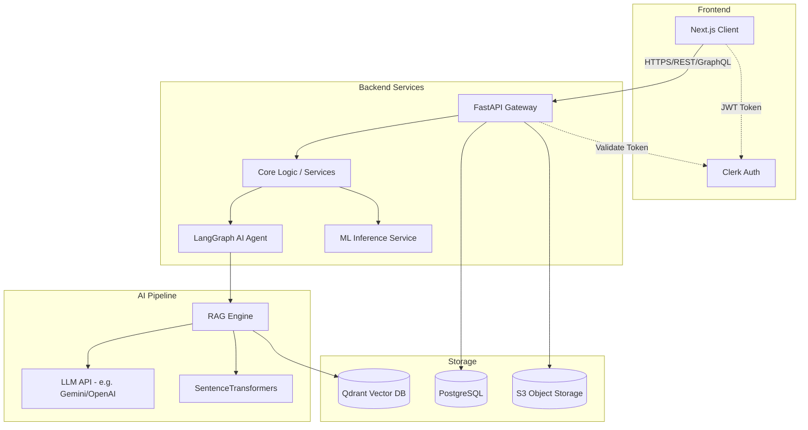
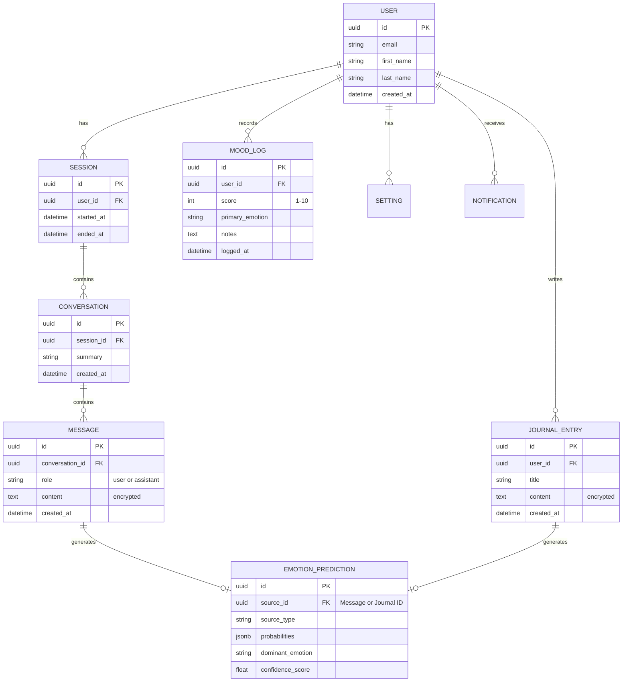
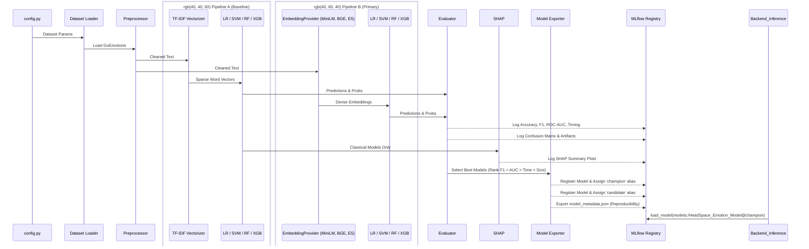
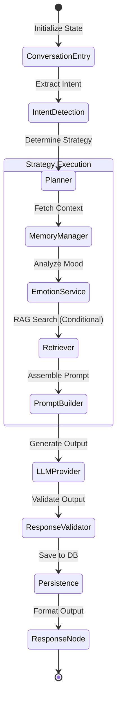
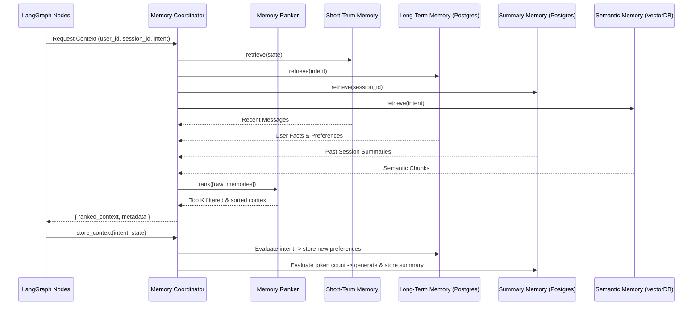
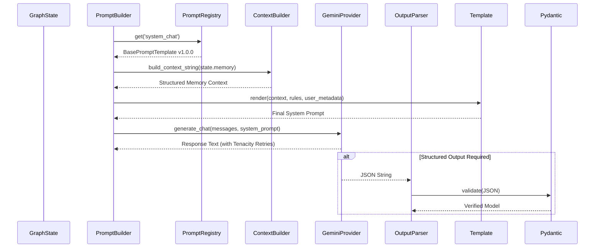
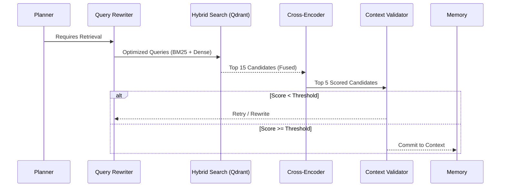
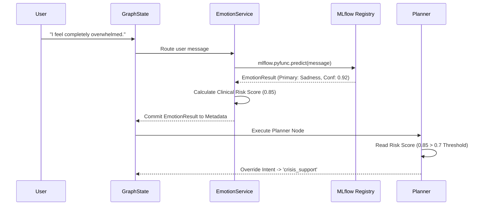
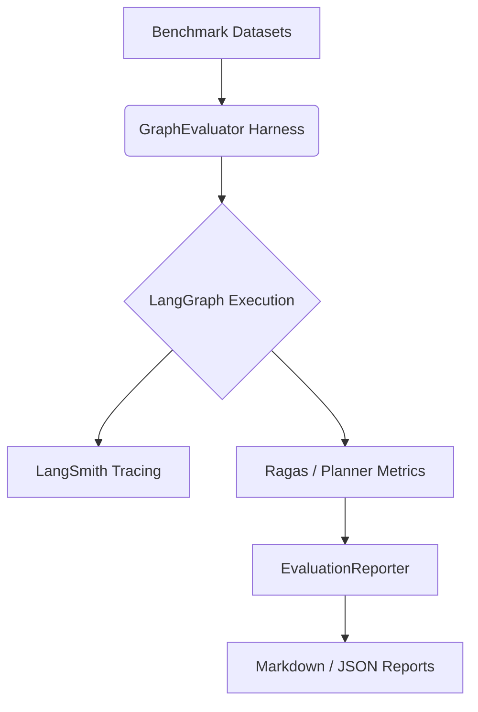
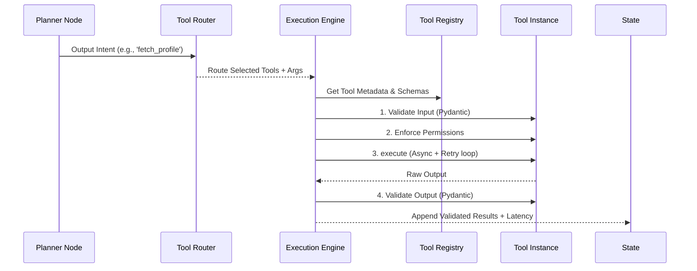

# HeadSpace AI Architecture

This document describes the high-level architecture of HeadSpace AI, a production-ready mental health companion.

## System Overview

## Database Entity Relationship Diagram

## Machine Learning Benchmarking Pipeline

## AI Orchestration Layer (Phase 2A)

The core conversational intelligence is orchestrated using a LangGraph StateGraph.

### StateGraph Execution Flow

### Abstraction Layers

To ensure long-term maintainability, the AI orchestration architecture strictly abstracts all external dependencies:

1. **LLM Provider (`app/ai/llm/`)**: Base interface allowing easy switching between Gemini (default), OpenAI, Anthropic, or local models.
2. **Memory System (`app/ai/memory/`)**: Modular interfaces for Short-Term, Long-Term, Semantic, and Summary memories.
3. **Retrieval Engine (`app/ai/retrieval/`)**: Abstracted VectorStore, Retriever, and Embedding interfaces to decouple from specific vendors (e.g., Qdrant).
4. **Tools Registry (`app/ai/tools/`)**: Centralized ToolRegistry that automatically maps and validates `BaseTool` instances for the LangGraph planner.

## Memory Subsystem (Phase 2B)

The Memory Subsystem handles Context aggregation for the LangGraph orchestrator. It uses a Memory Coordinator to merge multiple persistence timelines.

### Memory Lifecycle

### Supported Memory Types

1. **Short-Term Memory**: Thread-scoped, extracts exactly what is currently happening from the active LangGraph state array.
2. **Long-Term Memory**: Structured SQL facts (`LongTermMemoryItem`). Stores persistent user identity tokens like wellness goals and preferences.
3. **Summary Memory**: Rolling SQL records (`SummaryMemoryItem`). Automatically compresses old conversational context when token thresholds are reached.
4. **Semantic Memory**: Abstracted interface ready for Qdrant. Handles unstructured knowledge retrieval.

## Prompt Management & LLM Provider (Phase 2C)

This layer decouples string formatting from business logic and provides a resilient interface to Gemini.

### Prompt Lifecycle

### LLM Provider Abstraction
The `BaseLLMProvider` dictates standard signatures for:
- `generate()` (Single turn)
- `generate_chat()` (Multi-turn with history)
- `generate_stream()` (Yields chunks for real-time UI)
- `generate_structured()` (Forces JSON output matching a schema)

The active `GeminiProvider` implementation is decorated with `tenacity.retry` to handle transient network or rate-limiting failures automatically.

## Agentic Hybrid RAG (Phase 2D)

The retrieval subsystem avoids standard naive vector search by implementing an Agentic loop directly inside the LangGraph orchestrator.

### Retrieval Architecture

### Key Components

1. **Document Ingestion (`pipeline.py`)**: Supports PDF/MD extraction via PyMuPDF. Chunks documents recursively while preserving metadata (title, page, chunk_index).
2. **Hybrid Search (`qdrant.py`)**: Utilizes Qdrant's FastEmbed support to execute dual dense/sparse queries simultaneously, performing Reciprocal Rank Fusion (RRF) internally.
3. **Cross-Encoder Reranking (`reranker.py`)**: Passes candidates through a small local Transformer (`ms-marco-MiniLM`) to verify semantic relevance, drastically reducing hallucinations.
4. **Citations (`nodes_rag.py`)**: Automatically appends `[Source]` metadata links to the final LLM response if retrieved context was injected.

## Emotion Intelligence Layer (Phase 2E)

The standalone MLflow text classifier is now natively embedded into the LangGraph state flow, allowing dynamic conversation steering based on detected psychological states.

### Emotion Lifecycle

### Components
1. **`MLflowEmotionService`**: Abstracts the loading of the Champion model from the MLflow Tracking Server. Calculates deterministic clinical `risk_scores` based on confidence weighting of dangerous emotions (e.g. severe depression, anger).
2. **`EmotionTimelineItem`**: SQLAlchemy model that persists the emotional trajectory of a conversation, enabling long-term moving average mood tracking.
3. **Graph Routing**: The `builder.py` specifically routes `intent_detection -> emotion_service -> planner` so the planner has access to the highest fidelity psychological state of the user before deciding on memory retrieval or RAG execution paths.

## AI Evaluation Framework (Phase 2F)

The AI Evaluation Framework provides continuous, programatic measurement of the entire LangGraph architecture without polluting the production code base. It acts as a wrapper test harness capable of asserting regressions against predefined benchmarks.

### Evaluation Subsystem

### Core Technologies
- **LangSmith**: Used for native node-level tracing, tracking latency, token usage, prompt payloads, and retry rates.
- **Ragas**: A dedicated framework to calculate RAG quality metrics programmatically (Context Precision, Context Recall, Faithfulness, Answer Relevance).
- **PyTest Regression**: We run the evaluation metrics within PyTest to enforce CI/CD gates, generating human-readable HTML/Markdown dashboards showing regressions against previous architecture runs.

## Agent Tool Ecosystem (Phase 2G)

The Tool Runtime separates the LangGraph Planner (which selects tools to run) from the Execution Engine (which safely and securely executes them). This provides a resilient foundation for future AI capabilities (e.g., retrieving journals, scheduling sessions) to plug seamlessly into the graph.

### Tool Lifecycle

### Components
1. **`BaseTool`**: An abstract class providing strict `input_schema` and `output_schema` validation via Pydantic. Defines metadata like `retry_policy`, `required_permissions`, and `timeout`.
2. **`ToolExecutionEngine`**: A dedicated runner that handles async execution, automatic retries on failure (preventing graph crashes from transient network errors), and latency tracking.
3. **Graph Integration**: The `tool_execution` node sits strictly between the `planner` and the `memory_manager`, executing any tools requested by the planner's intent and appending the clean results directly to the GraphState.

### Future MCP Compatibility
This architecture is structurally designed to support the **Model Context Protocol (MCP)**. By standardizing tools against `input_schema` and `output_schema`, we can easily expose these local tools to remote MCP clients, or conversely, allow our LangGraph agent to dynamically mount remote MCP tool registries by writing an MCP-to-BaseTool adapter inside the `ToolRegistry`.

## Journal Intelligence Engine (Phase 3A)

The Journal Intelligence subsystem serves as the primary producer of long-term user knowledge, transforming raw journal entries into structured psychological insights using Gemini and the Tool Runtime.

### Journal Processing Lifecycle

1. **Submission**: User submits a journal entry.
2. **Intent Parsing**: The `Planner` node detects the `journal_entry` intent and routes it to the `ToolRouter`.
3. **Execution**: The `ToolExecutionEngine` safely executes the `JournalIntelligenceTool`, passing the raw text.
4. **Structured LLM Call**: The tool utilizes `PromptBuilder` to render the `JournalIntelligencePrompt` and uses the LLM provider to return a strictly parsed JSON object matching the `JournalAnalysisOutput` Pydantic schema.
5. **Memory Extraction**: The tool identifies long-term facts, goals, and recurring concerns as `MemoryUpdateSuggestion` objects.
6. **Persistence**: The GraphState is updated with the tool output, which the `MemoryCoordinator` later intercepts to update the Long-Term Memory (Postgres) and the `JournalAnalysis` tables.

### Key Outputs Extracted
- Summary & Core Themes
- Primary & Secondary Emotions
- Stress Score (1-10)
- Identified Cognitive Distortions
- Reflection Questions & Recommended Coping Strategies
- Planner Metadata (e.g., immediate crisis intervention flags)

## Safety & Crisis Intervention Layer (Phase 3B)

The Safety subsystem continuously monitors LangGraph state, ensuring that the AI operates within strict boundaries. It executes immediately *after* intent and emotion detection, but *before* the Planner, allowing it to override normal execution in emergency scenarios.

### Core Components
- **Safety Monitor & Risk Engine**: Evaluates current emotion risk, intent, explicit phrases in messages, and produces a strictly-typed `RiskAssessment`.
- **Safety Policies**: Pre-configured rules dictating how to handle `LOW`, `MODERATE`, `HIGH`, and `EMERGENCY` risks (e.g., overriding system prompts, enforcing specific tool usage).
- **Intervention Engine**: Responsible for mapping a high-risk `RiskAssessment` to actionable tools (e.g., `EmergencyResourceTool`, `GroundingTool`).

### Processing Lifecycle
1. **State Analysis**: The `safety_monitor` node extracts emotion risk scores and historical chat data from the `GraphState`.
2. **Risk Calculation**: The `RiskEngine` calculates a structured `RiskAssessment`.
3. **Planner Interception**: The `planner` node intercepts the `RiskAssessment`. If the risk is high or emergency, the planner discards normal intent and tools.
4. **Intervention Routing**: The `planner` defers to the `InterventionEngine`, which injects specialized tools and system prompt overrides to prioritize user safety over conversation flow.

### Important Boundary Disclaimer
> **Note**: HeadSpace AI is designed as a supportive wellness application, not a diagnostic or therapeutic system. The Safety & Crisis Intervention Layer is built to route users to professional help in emergencies, but it is **not a substitute for licensed mental health care**.

## Personalized Wellness Intelligence Engine (Phase 3C)

The Wellness Engine acts as the central synthesizer of user context, transforming disparate data points (emotion state, journal history, long-term memory, and user goals) into actionable, evidence-informed wellness guidance.

### Core Components
- **Context Aggregator**: Collects and formats current emotion risk, recent conversation history, long-term memory facts, and planner intent from the LangGraph State into a unified prompt context.
- **Wellness Intelligence Tool**: Orchestrates the aggregation, LLM prompting via `WellnessIntelligencePrompt`, and parsing of the `WellnessEngineOutput` Pydantic schema.
- **Safety Validator**: A strict post-generation check that routes the generated recommendations through the `RiskEngine` rules. If the user is in a high-risk state, generative advice is actively suppressed to prevent potential harm.

### Processing Lifecycle
1. **Trigger**: The Planner detects a `seek_guidance` intent and routes execution to the `WellnessIntelligenceTool`.
2. **Aggregation**: The tool uses `ContextAggregator` to build the context.
3. **Generation**: The LLM synthesizes the context and outputs a strictly typed JSON containing recommendations, priority, reasoning, action plans, and memory suggestions.
4. **Validation**: The `SafetyValidator` intercepts the output. If risk > Moderate, it nullifies generative recommendations and suggests predefined safe interventions instead.
5. **Fulfillment**: The validated recommendations are returned to the Planner and presented to the user.

## Analytics, Insights & Explainability Platform (Phase 4)

The Analytics platform acts as a read-only observability layer over the existing LangGraph data stores. It transforms raw conversational state, journal extractions, and memory vectors into visual trends and human-readable reports.

### Core Components
- **Trend Analyzer**: Calculates rolling averages and volatility scores for emotions and stress levels over time.
- **Pattern Detector**: Discovers correlations (e.g., "Late night journaling correlates with anxiety themes").
- **Explainability Engine**: Provides a transparent mapping between any generated recommendation and the specific evidence (journal IDs, memory facts, emotion states) that influenced it.
## Production Readiness (Final Phase)

HeadSpace AI is hardened for enterprise deployment.

### Infrastructure
- **Containerization**: Fully dockerized frontend, backend, and stateful services (Postgres, Qdrant, Redis).
- **Kubernetes**: Helm/YAML manifests available for Deployments, Services, Ingress, and Horizontal Pod Autoscalers (HPA).
- **CI/CD**: GitHub Actions pipeline automates linting, testing, security scanning (Trivy), and Docker builds.

### Security & Observability
- **Rate Limiting**: `SlowAPI` integration prevents abuse at the API gateway layer.
- **Metrics**: `Prometheus` and `OpenTelemetry` expose runtime metrics and distributed traces.
- **Caching**: `Redis` is integrated to cache high-latency operations and database queries.
- **Connection Pooling**: SQLAlchemy async engine utilizes robust pooling for high concurrency.
